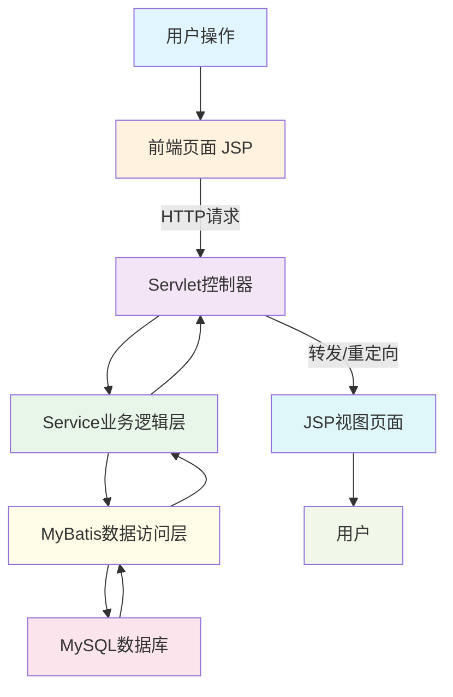

# 简易项目任务板（仿Trello）——JAVAWEB开发实战课程实验报告

---

## 封面

| 项目 | 内容 |
|------|------|
| **课程名称** | JAVAWEB开发实战 |
| **作品题目** | 简易项目任务板（仿Trello） |
| **学生姓名** | 杨文远 |
| **学号** | XXXXXXXXXX |
| **指导教师** | XXX |
| **提交日期** | 2026年1月5日 |

---

## 摘要与关键词

本实验项目设计并实现了一个简易项目任务板系统，该系统以Trello为原型，采用经典MVC架构进行开发。项目基于Java 1.8作为后端核心语言，使用Servlet 4.0处理HTTP请求与响应，JSP 2.3作为视图层技术实现页面渲染，数据持久化采用MyBatis 3.5框架连接MySQL 8.0数据库，前端界面采用Bootstrap 5.3构建响应式布局，Web容器选用Tomcat 9.0进行项目部署。

项目实现了任务列管理、任务增删改查、状态切换、进度统计、截止日期提醒等核心功能，并通过AJAX技术实现了页面的异步更新，提升了用户体验。在数据持久化方面，采用MyBatis的动态SQL和映射器机制，有效解决了数据库连接池管理和SQL注入安全问题。系统支持任务优先级标签设置和多端响应式布局适配，满足小型团队任务管理的基本需求。

本项目的开发过程严格遵循分层设计原则，将表示层、业务逻辑层和数据访问层清晰分离，便于代码的维护与扩展。通过本项目的开发，深入理解了Servlet生命周期、会话管理、事务处理等WEB开发核心技术，积累了从需求分析到系统部署的完整项目开发经验。

**关键词**：JAVAWEB；Servlet；MySQL；JSP；MVC；MyBatis；Bootstrap；数据持久化

---

## 一、项目概述

### 1.1 项目背景与目标

在现代软件开发和项目管理领域，任务看板作为一种直观、高效的任务管理工具，被广泛应用于各类团队协作场景。Trello作为该领域的代表性产品，以其简洁的卡片式界面和直观的拖拽操作赢得了广大用户的青睐。然而，企业级看板系统往往功能复杂、部署成本较高，对于小型团队和个人用户而言，轻量级的任务管理工具更能满足实际需求。

本项目旨在开发一个简易的项目任务板系统，其核心目标包含两个层面。从技术学习角度出发，本项目作为JAVAWEB开发实战课程的综合实验，要求学生能够综合运用所学知识，掌握从需求分析、系统设计到编码实现、测试部署的完整开发流程，深入理解MVC架构模式在WEB应用中的实践方法。从应用价值角度出发，本项目旨在为小型团队提供一个简洁实用的任务管理工具，支持任务的创建、编辑、删除、状态切换等基本操作，并提供进度统计和截止日期提醒等实用功能，帮助团队成员更好地跟踪项目进度。

### 1.2 功能需求分析

#### 1.2.1 核心功能

核心功能是本项目必须实现的基本功能模块，构成了任务板系统的业务基础。任务列管理功能支持对任务看板的列进行增加、删除和重命名操作，系统预设"待处理"、"进行中"、"已完成"三个默认列，用户可根据实际需求自定义任务分类。任务CRUD功能实现了任务的完整生命周期管理，用户可以创建新任务并设置标题、描述、优先级和截止日期，支持对已有任务的信息进行修改和更新，同时提供任务的删除功能。状态切换功能允许用户通过拖拽操作将任务在不同状态列之间移动，实现任务状态的直观变更，每次状态变更后系统自动记录变更时间。数据持久化功能确保所有任务数据存储至MySQL数据库，支持应用的多次会话间数据保持，即使关闭浏览器后重新访问，数据依然完整可用。进度统计功能实时计算并展示任务的总体数量、已完成数量和完成率百分比，帮助用户快速了解项目整体进展。截止日期提醒功能对设置了截止日期的任务进行状态监测，当任务临近截止或已过期时，通过视觉标识进行提醒，帮助用户及时处理紧急任务。

#### 1.2.2 扩展功能

扩展功能是在核心功能基础上增加的增强型特性，用于提升系统的实用性和用户体验。优先级标签功能为每个任务提供高、中、低三个优先级选项，不同优先级通过不同的颜色标签进行区分，用户可以快速识别任务的紧急程度。响应式布局功能采用Bootstrap框架实现自适应界面设计，系统在桌面端和移动端均能正常显示，通过栅格系统实现灵活的页面布局调整。

### 1.3 非功能需求分析

在非功能需求方面，本项目从四个维度进行了系统规划。性能方面，要求系统响应时间控制在1秒以内，页面加载流畅，数据库查询效率优化，避免N+1查询问题。兼容性方面，要求系统支持主流浏览器的正常使用，包括Chrome、Firefox、Edge、Safari等，同时在移动端浏览器中保持良好的展示效果。代码质量方面，要求遵循Java编码规范，类名、方法名命名清晰，代码注释完整，分层结构清晰，便于后续维护和功能扩展。用户体验方面，要求操作界面简洁直观，提供明确的操作反馈，如表单验证提示、操作成功提示等，异常情况给出友好的错误信息。

---

## 二、技术选型与架构设计

### 2.1 技术栈说明

本项目采用主流的JavaWEB技术栈进行开发，各技术组件的选型经过充分考量，具体信息如下表所示：

| 技术/框架 | 版本 | 选型理由 |
|---------|------|---------|
| **Java** | 1.8 | LTS长期支持版本，稳定可靠，语法成熟，是企业级应用开发的主流选择，课程教学重点内容 |
| **Servlet** | 4.0 | JavaEE 8规范的一部分，支持HTTP/2和服务器推送，提供了强大的请求处理能力，是WEB应用的核心技术 |
| **JSP** | 2.3 | 成熟的视图层技术，支持EL表达式和JSTL标签库，便于页面开发，与Servlet技术栈无缝集成 |
| **MySQL** | 8.0 | 开源关系型数据库，性能优异，支持JSON数据类型和窗口函数，社区活跃，文档完善 |
| **Bootstrap** | 5.3 | 流行的前端CSS框架，提供丰富的响应式组件和栅格系统，加速前端界面开发 |
| **MyBatis** | 3.5 | 优秀的持久层框架，支持自定义SQL、动态SQL和映射器配置，简化数据库操作，提高开发效率 |
| **Tomcat** | 9.0 | 轻量级WEB容器，完全支持Servlet 4.0规范，性能稳定，是开发和部署JAVAWEB应用的标准选择 |

### 2.2 系统架构设计

本项目采用经典的MVC（Model-View-Controller）架构模式进行设计，将系统划分为表示层、业务逻辑层和数据访问层三个层次，各层职责明确、松耦合。系统的整体架构流程如下所示：



在上述架构中，用户通过浏览器发起HTTP请求，首先到达JSP页面或直接到达Servlet控制器。控制器负责接收请求、解析参数、调用相应的业务逻辑处理方法，并将处理结果转发到视图页面进行渲染。Service层封装核心业务逻辑，如任务的新增、修改、删除、状态切换等。MyBatis数据访问层负责与MySQL数据库交互，执行SQL语句并将结果映射为Java对象。数据库层存储所有任务相关数据，包括任务基本信息、状态、优先级、截止日期等。

### 2.3 目录结构说明

本项目采用标准的MVC目录结构组织代码，完整的项目目录树状结构如下：

```
task-board/
├── src/
│   ├── main/
│   │   ├── java/
│   │   │   └── com/
│   │   │       └── taskboard/
│   │   │           ├── controller/          # 控制器层
│   │   │           │   ├── TaskController.java    # 任务控制器
│   │   │           │   ├── StatsController.java   # 统计控制器
│   │   │           │   └── ColumnController.java  # 列管理控制器
│   │   │           ├── service/             # 业务逻辑层
│   │   │           │   ├── TaskService.java       # 任务服务接口
│   │   │           │   └── TaskServiceImpl.java   # 任务服务实现
│   │   │           ├── mapper/              # MyBatis映射器
│   │   │           │   ├── TaskMapper.java        # 任务映射接口
│   │   │           │   └── TaskMapper.xml         # SQL映射文件
│   │   │           ├── entity/              # 实体类
│   │   │           │   ├── Task.java              # 任务实体
│   │   │           │   └── Column.java            # 任务列实体
│   │   │           └── util/                # 工具类
│   │   │               ├── DBUtil.java            # 数据库连接工具
│   │   │               └── DateUtil.java          # 日期处理工具
│   │   └── webapp/
│   │       ├── WEB-INF/
│   │       │   └── web.xml                  # Web部署描述符
│   │       ├── views/                       # JSP页面
│   │       │   ├── index.jsp                # 首页/看板视图
│   │       │   ├── tasks.jsp                # 任务列表页
│   │       │   └── stats.jsp                # 统计页面
│   │       ├── css/                         # 样式文件
│   │       │   └── style.css                # 自定义样式
│   │       └── js/                          # JavaScript文件
│   │           └── app.js                   # 前端交互逻辑
│   └── test/
│       └── java/                            # 测试类
├── pom.xml                                  # Maven配置
└── README.md                                # 项目说明
```

该目录结构清晰体现了MVC分层设计思想：controller包存放Servlet控制器，负责请求调度；service包存放业务逻辑实现类；mapper包存放MyBatis映射器和SQL文件；entity包存放POJO实体类；util包存放工具类；webapp下的views目录存放JSP视图页面，css和js目录分别存放样式和脚本文件。

---

## 三、核心功能模块详细设计与实现

### 3.1 模块一：数据持久化与任务实体设计

#### 3.1.1 设计思路

数据持久化是本项目的基础模块，负责将任务数据持久化存储到MySQL数据库中，并在需要时将数据重新加载到内存。在实体设计方面，采用面向对象的设计思想，将任务和任务列分别抽象为Task和Column两个实体类，每个实体类封装了对应的属性和操作方法。数据库设计方面，根据业务需求设计合理的数据表结构，使用外键关联任务与任务列的关系。MyBatis框架用于简化数据库操作，通过映射器将Java对象与数据库记录进行转换。DBUtil工具类负责管理数据库连接池，确保连接资源的有效利用和及时释放。

#### 3.1.2 关键代码与解释

**Task实体类**是任务数据的核心载体，封装了任务的所有属性信息：

```java
package com.taskboard.entity;

import java.util.Date;

/**
 * 任务实体类
 * 封装任务的所有属性信息，包括标题、描述、优先级、截止日期等
 */
public class Task {
    
    // 任务唯一标识
    private Long id;
    
    // 任务标题
    private String title;
    
    // 任务详细描述
    private String description;
    
    // 任务优先级：high-高、medium-中、low-低
    private String priority;
    
    // 所属列ID，外键关联column表
    private Long columnId;
    
    // 任务截止日期
    private Date dueDate;
    
    // 任务创建时间
    private Date createdAt;
    
    // 任务完成时间
    private Date completedAt;
    
    // 任务排序位置
    private Integer sortOrder;
    
    // 构造方法
    public Task() {
    }
    
    public Task(String title, String description, String priority, Long columnId) {
        this.title = title;
        this.description = description;
        this.priority = priority;
        this.columnId = columnId;
        this.createdAt = new Date();
        this.sortOrder = 0;
    }
    
    // Getter和Setter方法
    public Long getId() {
        return id;
    }
    
    public void setId(Long id) {
        this.id = id;
    }
    
    public String getTitle() {
        return title;
    }
    
    public void setTitle(String title) {
        this.title = title;
    }
    
    public String getDescription() {
        return description;
    }
    
    public void setDescription(String description) {
        this.description = description;
    }
    
    public String getPriority() {
        return priority;
    }
    
    public void setPriority(String priority) {
        this.priority = priority;
    }
    
    public Long getColumnId() {
        return columnId;
    }
    
    public void setColumnId(Long columnId) {
        this.columnId = columnId;
    }
    
    public Date getDueDate() {
        return dueDate;
    }
    
    public void setDueDate(Date dueDate) {
        this.dueDate = dueDate;
    }
    
    public Date getCreatedAt() {
        return createdAt;
    }
    
    public void setCreatedAt(Date createdAt) {
        this.createdAt = createdAt;
    }
    
    public Date getCompletedAt() {
        return completedAt;
    }
    
    public void setCompletedAt(Date completedAt) {
        this.completedAt = completedAt;
    }
    
    public Integer getSortOrder() {
        return sortOrder;
    }
    
    public void setSortOrder(Integer sortOrder) {
        this.sortOrder = sortOrder;
    }
    
    /**
     * 判断任务是否已完成
     */
   () {
        return public boolean isCompleted completedAt != null;
    }
    
    /**
     * 判断任务是否已过期
     */
    public boolean isOverdue() {
        return dueDate != null && dueDate.before(new Date()) && !isCompleted();
    }
}
```

**数据库建表SQL**定义了任务和任务列的数据表结构：

```sql
-- 创建任务列表
CREATE TABLE `column` (
    `id` BIGINT NOT NULL AUTO_INCREMENT COMMENT '列ID',
    `title` VARCHAR(100) NOT NULL COMMENT '列标题',
    `sort_order` INT DEFAULT 0 COMMENT '排序序号',
    `created_at` DATETIME DEFAULT CURRENT_TIMESTAMP COMMENT '创建时间',
    PRIMARY KEY (`id`),
    INDEX idx_sort_order (`sort_order`)
) ENGINE=InnoDB DEFAULT CHARSET=utf8mb4 COMMENT='任务列表';

-- 创建任务表
CREATE TABLE `task` (
    `id` BIGINT NOT NULL AUTO_INCREMENT COMMENT '任务ID',
    `title` VARCHAR(200) NOT NULL COMMENT '任务标题',
    `description` TEXT COMMENT '任务描述',
    `priority` VARCHAR(20) DEFAULT 'medium' COMMENT '优先级：high/medium/low',
    `column_id` BIGINT NOT NULL COMMENT '所属列ID',
    `due_date` DATETIME COMMENT '截止日期',
    `created_at` DATETIME DEFAULT CURRENT_TIMESTAMP COMMENT '创建时间',
    `completed_at` DATETIME COMMENT '完成时间',
    `sort_order` INT DEFAULT 0 COMMENT '排序序号',
    PRIMARY KEY (`id`),
    INDEX idx_column_id (`column_id`),
    INDEX idx_due_date (`due_date`),
    INDEX idx_priority (`priority`),
    CONSTRAINT fk_task_column FOREIGN KEY (`column_id`) 
        REFERENCES `column`(`id`) ON DELETE CASCADE
) ENGINE=InnoDB DEFAULT CHARSET=utf8mb4 COMMENT='任务表';

-- 插入默认列数据
INSERT INTO `column` (`title`, `sort_order`) VALUES 
    ('待处理', 1),
    ('进行中', 2),
    ('已完成', 3);
```

**DBUtil工具类**负责数据库连接的管理，采用连接池机制优化数据库访问性能：

```java
package com.taskboard.util;

import com.alibaba.druid.pool.DruidDataSource;
import java.sql.Connection;
import java.sql.SQLException;

/**
 * 数据库连接工具类
 * 使用Druid连接池管理数据库连接，优化连接复用和资源释放
 */
public class DBUtil {
    
    // Druid数据源，单例模式确保全局唯一
    private static DruidDataSource dataSource;
    
    // 数据库配置参数
    private static final String DRIVER_CLASS = "com.mysql.cj.jdbc.Driver";
    private static final String URL = "jdbc:mysql://localhost:3306/taskboard?useUnicode=true&characterEncoding=UTF-8&serverTimezone=Asia/Shanghai";
    private static final String USERNAME = "root";
    private static final String PASSWORD = "password";
    
    // 连接池配置
    private static final int INITIAL_SIZE = 5;
    private static final int MIN_IDLE = 5;
    private static final int MAX_ACTIVE = 20;
    
    /**
     * 静态代码块，类加载时初始化数据源
     */
    static {
        initDataSource();
    }
    
    /**
     * 初始化Druid数据源
     */
    private static void initDataSource() {
        dataSource = new DruidDataSource();
        dataSource.setDriverClassName(DRIVER_CLASS);
        dataSource.setUrl(URL);
        dataSource.setUsername(USERNAME);
        dataSource.setPassword(PASSWORD);
        
        // 连接池参数配置
        dataSource.setInitialSize(INITIAL_SIZE);
        dataSource.setMinIdle(MIN_IDLE);
        dataSource.setMaxActive(MAX_ACTIVE);
        
        // 连接检测配置
        dataSource.setValidationQuery("SELECT 1");
        dataSource.setTestOnBorrow(false);
        dataSource.setTestWhileIdle(true);
        dataSource.setTimeBetweenEvictionRunsMillis(60000);
    }
    
    /**
     * 获取数据库连接
     * @return 数据库连接对象
     * @throws SQLException 连接获取失败时抛出异常
     */
    public static Connection getConnection() throws SQLException {
        return dataSource.getConnection();
    }
    
    /**
     * 关闭连接，将连接归还连接池而非真正关闭
     * @param connection 要关闭的数据库连接
     */
    public static void closeConnection(Connection connection) {
        if (connection != null) {
            try {
                connection.close(); // 连接池实现会实际进行复用
            } catch (SQLException e) {
                System.err.println("关闭数据库连接失败: " + e.getMessage());
            }
        }
    }
    
    /**
     * 关闭所有连接，销毁连接池
     */
    public static void closeDataSource() {
        if (dataSource != null) {
            dataSource.close();
        }
    }
}
```

#### 3.1.3 难点与解决方案

**难点一：数据库连接性能损耗问题**。在WEB应用中，频繁创建和销毁数据库连接会产生显著的性能开销，每次建立新连接需要经过TCP三次握手、数据库认证等过程，耗时可达数十毫秒。传统的每次使用后关闭连接的方式在高并发场景下性能表现不佳。

**解决方案**：采用Druid连接池技术实现连接复用。连接池预先创建一定数量的连接放入池中，当应用需要访问数据库时，从池中获取可用连接使用，使用完毕后归还池中而非关闭。这样避免了重复创建连接的开销，显著提升了数据库访问性能。DBUtil工具类中配置了初始连接数、最大连接数、空闲连接检测等参数，确保连接资源的合理利用。

**难点二：日期字段格式统一问题**。MySQL的DATETIME类型与Java的Date类型在存储和读取时存在格式转换问题，不同时间时区可能导致日期数据出现偏差。此外，前端页面展示需要特定格式的日期字符串。

**解决方案**：在MyBatis配置中设置全局日期处理规则，指定JDBC类型和Java类型的转换映射。在DateUtil工具类中提供多种日期格式化方法，支持数据库存储格式、页面展示格式和API响应格式的转换。对于涉及日期比较的操作，统一使用Java时区处理，避免时区差异导致的数据不一致。

### 3.2 模块二：任务增删改查与状态切换

#### 3.2.1 设计思路

任务增删改查（CRUD）是任务板系统的核心业务功能，涵盖任务的创建、读取、更新、删除四个基本操作。状态切换功能允许用户通过直观的拖拽操作将任务在不同状态列之间移动，实现任务状态的变更。在架构设计上，采用Servlet作为控制器接收HTTP请求，Service层封装业务逻辑，MyBatis完成数据持久化。前端采用AJAX技术与后端进行异步交互，实现页面的局部刷新，避免整页重新加载带来的用户体验问题。

#### 3.2.2 关键代码与解释

**TaskController控制器**处理所有与任务相关的HTTP请求：

```java
package com.taskboard.controller;

import com.taskboard.entity.Task;
import com.taskboard.service.TaskService;
import com.taskboard.service.TaskServiceImpl;
import javax.servlet.ServletException;
import javax.servlet.annotation.WebServlet;
import javax.servlet.http.HttpServlet;
import javax.servlet.http.HttpServletRequest;
import javax.servlet.http.HttpServletResponse;
import java.io.IOException;
import java.io.PrintWriter;
import java.util.List;

/**
 * 任务控制器
 * 处理任务的增删改查及状态切换请求
 */
@WebServlet(urlPatterns = {"/api/task", "/api/task/*"})
public class TaskController extends HttpServlet {
    
    private TaskService taskService;
    
    /**
     * 控制器初始化方法，创建Service实例
     */
    @Override
    public void init() throws ServletException {
        taskService = new TaskServiceImpl();
    }
    
    /**
     * 处理GET请求，获取任务列表或单个任务详情
     */
    @Override
    protected void doGet(HttpServletRequest request, HttpServletResponse response) 
            throws ServletException, IOException {
        
        // 设置请求和响应编码
        request.setCharacterEncoding("UTF-8");
        response.setContentType("application/json;charset=UTF-8");
        
        // 解析URL路径，判断是获取列表还是单个任务
        String pathInfo = request.getPathInfo();
        PrintWriter out = response.getWriter();
        
        try {
            if (pathInfo == null || pathInfo.equals("/")) {
                // 获取所有任务或按列筛选
                Long columnId = null;
                String columnIdParam = request.getParameter("columnId");
                if (columnIdParam != null && !columnIdParam.isEmpty()) {
                    columnId = Long.parseLong(columnIdParam);
                }
                
                List<Task> tasks = taskService.getTasksByColumn(columnId);
                String json = taskService.tasksToJson(tasks);
                out.print(json);
            } else {
                // 获取单个任务详情
                Long taskId = Long.parseLong(pathInfo.substring(1));
                Task task = taskService.getTaskById(taskId);
                if (task != null) {
                    String json = taskService.taskToJson(task);
                    out.print(json);
                } else {
                    response.setStatus(HttpServletResponse.SC_NOT_FOUND);
                    out.print("{\"error\":\"任务不存在\"}");
                }
            }
        } catch (Exception e) {
            response.setStatus(HttpServletResponse.SC_INTERNAL_SERVER_ERROR);
            out.print("{\"error\":\"" + e.getMessage() + "\"}");
        }
    }
    
    /**
     * 处理POST请求，创建新任务
     */
    @Override
    protected void doPost(HttpServletRequest request, HttpServletResponse response) 
            throws ServletException, IOException {
        
        request.setCharacterEncoding("UTF-8");
        response.setContentType("application/json;charset=UTF-8");
        
        PrintWriter out = response.getWriter();
        
        try {
            // 接收请求参数
            String title = request.getParameter("title");
            String description = request.getParameter("description");
            String priority = request.getParameter("priority");
            Long columnId = Long.parseLong(request.getParameter("columnId"));
            String dueDateStr = request.getParameter("dueDate");
            
            // 参数验证
            if (title == null || title.trim().isEmpty()) {
                response.setStatus(HttpServletResponse.SC_BAD_REQUEST);
                out.print("{\"error\":\"任务标题不能为空\"}");
                return;
            }
            
            // 创建任务
            Task task = new Task(title, description, priority, columnId);
            if (dueDateStr != null && !dueDateStr.isEmpty()) {
                task.setDueDate(taskService.parseDate(dueDateStr));
            }
            
            Task createdTask = taskService.createTask(task);
            
            response.setStatus(HttpServletResponse.SC_CREATED);
            out.print("{\"success\":true,\"task\":" + taskService.taskToJson(createdTask) + "}");
        } catch (Exception e) {
            response.setStatus(HttpServletResponse.SC_INTERNAL_SERVER_ERROR);
            out.print("{\"error\":\"" + e.getMessage() + "\"}");
        }
    }
    
    /**
     * 处理PUT请求，更新任务信息或切换状态
     */
    @Override
    protected void doPut(HttpServletRequest request, HttpServletResponse response) 
            throws ServletException, IOException {
        
        request.setCharacterEncoding("UTF-8");
        response.setContentType("application/json;charset=UTF-8");
        
        PrintWriter out = response.getWriter();
        
        try {
            // 解析路径获取任务ID
            String pathInfo = request.getPathInfo();
            if (pathInfo == null || pathInfo.equals("/")) {
                response.setStatus(HttpServletResponse.SC_BAD_REQUEST);
                out.print("{\"error\":\"缺少任务ID\"}");
                return;
            }
            
            Long taskId = Long.parseLong(pathInfo.substring(1));
            
            // 接收更新参数
            String title = request.getParameter("title");
            String description = request.getParameter("description");
            String priority = request.getParameter("priority");
            String dueDateStr = request.getParameter("dueDate");
            Long columnId = request.getParameter("columnId") != null 
                    ? Long.parseLong(request.getParameter("columnId")) : null;
            
            // 构建更新数据
            Task updates = new Task();
            if (title != null) updates.setTitle(title);
            if (description != null) updates.setDescription(description);
            if (priority != null) updates.setPriority(priority);
            if (dueDateStr != null && !dueDateStr.isEmpty()) {
                updates.setDueDate(taskService.parseDate(dueDateStr));
            }
            if (columnId != null) {
                updates.setColumnId(columnId);
                // 如果移动到已完成列，自动设置完成时间
                if (taskService.isDoneColumn(columnId)) {
                    updates.setCompletedAt(new Date());
                }
            }
            
            boolean success = taskService.updateTask(taskId, updates);
            
            if (success) {
                out.print("{\"success\":true}");
            } else {
                response.setStatus(HttpServletResponse.SC_NOT_FOUND);
                out.print("{\"error\":\"任务不存在或更新失败\"}");
            }
        } catch (Exception e) {
            response.setStatus(HttpServletResponse.SC_INTERNAL_SERVER_ERROR);
            out.print("{\"error\":\"" + e.getMessage() + "\"}");
        }
    }
    
    /**
     * 处理DELETE请求，删除任务
     */
    @Override
    protected void doDelete(HttpServletRequest request, HttpServletResponse response) 
            throws ServletException, IOException {
        
        request.setCharacterEncoding("UTF-8");
        response.setContentType("application/json;charset=UTF-8");
        
        PrintWriter out = response.getWriter();
        
        try {
            String pathInfo = request.getPathInfo();
            if (pathInfo == null || pathInfo.equals("/")) {
                response.setStatus(HttpServletResponse.SC_BAD_REQUEST);
                out.print("{\"error\":\"缺少任务ID\"}");
                return;
            }
            
            Long taskId = Long.parseLong(pathInfo.substring(1));
            boolean success = taskService.deleteTask(taskId);
            
            if (success) {
                out.print("{\"success\":true}");
            } else {
                response.setStatus(HttpServletResponse.SC_NOT_FOUND);
                out.print("{\"error\":\"任务不存在\"}");
            }
        } catch (Exception e) {
            response.setStatus(HttpServletResponse.SC_INTERNAL_SERVER_ERROR);
            out.print("{\"error\":\"" + e.getMessage() + "\"}");
        }
    }
}
```

**前端AJAX交互代码**实现与后端的异步通信：

```javascript
/**
 * 任务管理前端交互模块
 * 使用AJAX技术与后端Servlet进行异步数据交换
 */

// API基础地址
const API_BASE = '/task-board/api/task';

// 任务状态常量
const TaskStatus = {
    TODO: 'todo',
    IN_PROGRESS: 'in-progress',
    DONE: 'done'
};

/**
 * 获取任务列表
 * @param {Long} columnId - 可选，按列筛选
 * @returns {Promise} 任务列表Promise
 */
async function fetchTasks(columnId = null) {
    const url = columnId ? `${API_BASE}?columnId=${columnId}` : API_BASE;
    const response = await fetch(url, { method: 'GET' });
    if (!response.ok) {
        throw new Error('获取任务列表失败');
    }
    return await response.json();
}

/**
 * 获取单个任务详情
 * @param {Long} taskId - 任务ID
 * @returns {Promise} 任务详情Promise
 */
async function fetchTask(taskId) {
    const response = await fetch(`${API_BASE}/${taskId}`, { method: 'GET' });
    if (!response.ok) {
        throw new Error('获取任务详情失败');
    }
    return await response.json();
}

/**
 * 创建新任务
 * @param {Object} taskData - 任务数据对象
 * @returns {Promise} 创建结果Promise
 */
async function createTask(taskData) {
    const params = new URLSearchParams();
    params.append('title', taskData.title);
    if (taskData.description) params.append('description', taskData.description);
    if (taskData.priority) params.append('priority', taskData.priority);
    params.append('columnId', taskData.columnId);
    if (taskData.dueDate) params.append('dueDate', taskData.dueDate);
    
    const response = await fetch(API_BASE, {
        method: 'POST',
        headers: {
            'Content-Type': 'application/x-www-form-urlencoded'
        },
        body: params
    });
    
    if (!response.ok) {
        const error = await response.json();
        throw new Error(error.error || '创建任务失败');
    }
    return await response.json();
}

/**
 * 更新任务信息
 * @param {Long} taskId - 任务ID
 * @param {Object} updates - 更新数据对象
 * @returns {Promise} 更新结果Promise
 */
async function updateTask(taskId, updates) {
    const params = new URLSearchParams();
    if (updates.title) params.append('title', updates.title);
    if (updates.description) params.append('description', updates.description);
    if (updates.priority) params.append('priority', updates.priority);
    if (updates.columnId) params.append('columnId', updates.columnId);
    if (updates.dueDate) params.append('dueDate', updates.dueDate);
    
    const response = await fetch(`${API_BASE}/${taskId}`, {
        method: 'PUT',
        headers: {
            'Content-Type': 'application/x-www-form-urlencoded'
        },
        body: params
    });
    
    if (!response.ok) {
        const error = await response.json();
        throw new Error(error.error || '更新任务失败');
    }
    return await response.json();
}

/**
 * 删除任务
 * @param {Long} taskId - 任务ID
 * @returns {Promise} 删除结果Promise
 */
async function deleteTask(taskId) {
    const response = await fetch(`${API_BASE}/${taskId}`, { method: 'DELETE' });
    if (!response.ok) {
        const error = await response.json();
        throw new Error(error.error || '删除任务失败');
    }
    return await response.json();
}

/**
 * 切换任务状态（移动任务到其他列）
 * @param {Long} taskId - 任务ID
 * @param {String} targetColumnId - 目标列ID
 * @returns {Promise} 切换结果Promise
 */
async function moveTask(taskId, targetColumnId) {
    return await updateTask(taskId, { columnId: targetColumnId });
}

/**
 * 拖拽任务处理函数
 * @param {DragEvent} event - 拖拽事件对象
 * @param {Long} taskId - 被拖拽的任务ID
 * @param {String} fromColumnId - 源列ID
 * @param {String} toColumnId - 目标列ID
 */
async function handleTaskDrop(event, taskId, fromColumnId, toColumnId) {
    try {
        await moveTask(taskId, toColumnId);
        showMessage('任务状态已更新', 'success');
        refreshTaskBoard();
    } catch (error) {
        showMessage('更新失败: ' + error.message, 'error');
    }
}

/**
 * 显示操作提示消息
 * @param {String} message - 消息内容
 * @param {String} type - 消息类型：success/warning/error
 */
function showMessage(message, type = 'success') {
    const messageDiv = document.createElement('div');
    messageDiv.className = `alert alert-${type}`;
    messageDiv.textContent = message;
    document.body.appendChild(messageDiv);
    setTimeout(() => messageDiv.remove(), 3000);
}
```

**JSP页面核心展示代码**负责页面渲染和用户交互：

```jsp
<%@ page language="java" contentType="text/html; charset=UTF-8" pageEncoding="UTF-8"%>
<%@ taglib prefix="c" uri="http://java.sun.com/jsp/jstl/core" %>
<!DOCTYPE html>
<html lang="zh-CN">
<head>
    <meta charset="UTF-8">
    <meta name="viewport" content="width=device-width, initial-scale=1.0">
    <title>项目任务板</title>
    <!-- 引入Bootstrap CSS -->
    <link href="${pageContext.request.contextPath}/css/bootstrap.min.css" rel="stylesheet">
    <!-- 自定义样式 -->
    <link href="${pageContext.request.contextPath}/css/style.css" rel="stylesheet">
</head>
<body>
    <!-- 导航栏 -->
    <nav class="navbar navbar-dark bg-dark">
        <div class="container-fluid">
            <a class="navbar-brand" href="#">
                <i class="bi bi-kanban"></i> 项目任务板
            </a>
            <button class="btn btn-outline-light" data-bs-toggle="modal" 
                    data-bs-target="#taskModal" onclick="prepareCreateTask()">
                <i class="bi bi-plus-lg"></i> 新建任务
            </button>
        </div>
    </nav>
    
    <!-- 主内容区域：任务看板 -->
    <div class="container-fluid py-4">
        <div class="row g-4" id="taskBoard">
            <c:forEach items="${columns}" var="column">
                <div class="col-md-4">
                    <div class="column" data-column-id="${column.id}"
                         ondragover="allowDrop(event)"
                         ondrop="drop(event)">
                        <div class="column-header bg-${column.color}">
                            <h5 class="mb-0">${column.title}</h5>
                            <span class="badge bg-light text-dark">${column.taskCount}</span>
                        </div>
                        <div class="column-body" id="column-${column.id}">
                            <c:forEach items="${column.tasks}" var="task">
                                <div class="task-card" 
                                     id="task-${task.id}"
                                     draggable="true"
                                     ondragstart="drag(event)"
                                     onclick="editTask(${task.id})">
                                    <div class="task-priority priority-${task.priority}">
                                        ${task.priorityLabel}
                                    </div>
                                    <h6 class="task-title">${task.title}</h6>
                                    <c:if test="${not empty task.description}">
                                        <p class="task-desc">${task.description}</p>
                                    </c:if>
                                    <div class="task-meta">
                                        <c:if test="${not empty task.dueDate}">
                                            <span class="due-date ${task.overdue ? 'text-danger' : ''}">
                                                <i class="bi bi-clock"></i> ${task.dueDateFormatted}
                                            </span>
                                        </c:if>
                                        <span class="created-at">
                                            <i class="bi bi-calendar3"></i> ${task.createdDateFormatted}
                                        </span>
                                    </div>
                                </div>
                            </c:forEach>
                        </div>
                        <div class="column-footer">
                            <button class="btn btn-sm btn-outline-primary w-100"
                                    onclick="showAddTaskModal('${column.id}')">
                                <i class="bi bi-plus"></i> 添加任务
                            </button>
                        </div>
                    </div>
                </div>
            </c:forEach>
        </div>
    </div>
    
    <!-- 任务表单模态框 -->
    <div class="modal fade" id="taskModal" tabindex="-1">
        <div class="modal-dialog">
            <div class="modal-content">
                <div class="modal-header">
                    <h5 class="modal-title" id="taskModalTitle">新建任务</h5>
                    <button type="button" class="btn-close" data-bs-dismiss="modal"></button>
                </div>
                <div class="modal-body">
                    <form id="taskForm">
                        <input type="hidden" id="taskId" name="taskId">
                        <input type="hidden" id="columnId" name="columnId">
                        <div class="mb-3">
                            <label for="taskTitle" class="form-label">任务标题 *</label>
                            <input type="text" class="form-control" id="taskTitle" 
                                   name="title" required maxlength="200">
                        </div>
                        <div class="mb-3">
                            <label for="taskDescription" class="form-label">任务描述</label>
                            <textarea class="form-control" id="taskDescription" 
                                      name="description" rows="3"></textarea>
                        </div>
                        <div class="mb-3">
                            <label for="taskPriority" class="form-label">优先级</label>
                            <select class="form-select" id="taskPriority" name="priority">
                                <option value="low">低</option>
                                <option value="medium" selected>中</option>
                                <option value="high">高</option>
                            </select>
                        </div>
                        <div class="mb-3">
                            <label for="taskDueDate" class="form-label">截止日期</label>
                            <input type="date" class="form-control" id="taskDueDate" 
                                   name="dueDate">
                        </div>
                    </form>
                </div>
                <div class="modal-footer">
                    <button type="button" class="btn btn-secondary" 
                            data-bs-dismiss="modal">取消</button>
                    <button type="button" class="btn btn-primary" 
                            onclick="saveTask()">保存</button>
                    <button type="button" class="btn btn-danger d-none" 
                            id="deleteTaskBtn" onclick="confirmDeleteTask()">删除</button>
                </div>
            </div>
        </div>
    </div>
    
    <!-- 引入Bootstrap JS -->
    <script src="${pageContext.request.contextPath}/js/bootstrap.bundle.min.js"></script>
    <!-- 引入应用JS -->
    <script src="${pageContext.request.contextPath}/js/app.js"></script>
</body>
</html>
```

#### 3.2.3 难点与解决方案

**难点一：中文乱码问题**。在WEB应用开发中，中文字符经常出现乱码问题，主要原因包括HTTP请求参数编码、数据库存储编码、页面输出编码等多个环节的不一致。当用户提交包含中文的任务标题或描述时，如果编码处理不当，会出现显示为问号或乱码的情况。

**解决方案**：在项目中对编码进行全局配置。Servlet接收请求时设置request.setCharacterEncoding("UTF-8")，响应输出时设置response.setContentType("application/json;charset=UTF-8")或response.setCharacterEncoding("UTF-8")。数据库连接URL中添加useUnicode=true&characterEncoding=UTF-8参数。JSP页面设置pageEncoding="UTF-8"和contentType="text/html; charset=UTF-8"。通过全链路编码统一，确保中文数据在各环节正确传输和存储。

**难点二：页面实时更新问题**。传统的表单提交会导致页面整页刷新，用户体验较差。特别是在任务状态切换场景中，如果每次拖拽操作都触发页面刷新，会打断用户的操作流程，影响使用体验。

**解决方案**：采用AJAX技术实现页面的异步更新。任务的新增、修改、删除、状态切换等操作都通过AJAX请求与后端交互，后端返回JSON格式的响应，前端根据响应结果动态更新DOM元素。同时使用事件委托机制处理动态添加的任务卡片的事件绑定，确保新创建的元素也能正确响应用户操作。结合Bootstrap的模态框组件，实现表单提交后自动关闭模态框并刷新列表的无感知操作体验。

### 3.3 模块三：进度统计与截止日期提醒

#### 3.3.1 设计思路

进度统计模块负责实时计算和展示项目的整体任务数据，包括任务总数、已完成数量、待完成数量和完成率等指标。该模块通过聚合查询从数据库获取统计数据，使用计算属性生成百分比数据，前端通过进度条组件可视化展示。日期提醒模块负责监测任务的截止日期状态，对临近截止或已过期的任务进行视觉标识提醒。DateUtil工具类提供日期格式化和日期差值计算功能，确保日期相关逻辑的一致性和可维护性。

#### 3.3.2 关键代码与解释

**StatsController统计控制器**负责处理统计相关的HTTP请求：

```java
package com.taskboard.controller;

import com.taskboard.service.TaskService;
import com.taskboard.service.TaskServiceImpl;
import javax.servlet.ServletException;
import javax.servlet.annotation.WebServlet;
import javax.servlet.http.HttpServlet;
import javax.servlet.http.HttpServletRequest;
import javax.servlet.http.HttpServletResponse;
import java.io.IOException;
import java.io.PrintWriter;
import java.util.HashMap;
import java.util.Map;

/**
 * 统计控制器
 * 处理任务统计数据和进度相关请求
 */
@WebServlet(urlPatterns = {"/api/stats", "/api/stats/summary"})
public class StatsController extends HttpServlet {
    
    private TaskService taskService;
    
    @Override
    public void init() throws ServletException {
        taskService = new TaskServiceImpl();
    }
    
    /**
     * 处理GET请求，获取统计摘要数据
     */
    @Override
    protected void doGet(HttpServletRequest request, HttpServletResponse response) 
            throws ServletException, IOException {
        
        request.setCharacterEncoding("UTF-8");
        response.setContentType("application/json;charset=UTF-8");
        
        PrintWriter out = response.getWriter();
        
        try {
            // 获取各列任务数量
            int totalTasks = taskService.countAllTasks();
            int todoTasks = taskService.countTasksByColumn("todo");
            int inProgressTasks = taskService.countTasksByColumn("in-progress");
            int doneTasks = taskService.countTasksByColumn("done");
            
            // 计算完成率，避免除零错误
            int completionRate = totalTasks > 0 
                    ? (int) Math.round((double) doneTasks / totalTasks * 100) 
                    : 0;
            
            // 获取即将到期的任务数量
            int upcomingTasks = taskService.countUpcomingTasks(3); // 3天内
            
            // 构建统计结果JSON
            Map<String, Object> stats = new HashMap<>();
            stats.put("totalTasks", totalTasks);
            stats.put("todoTasks", todoTasks);
            stats.put("inProgressTasks", inProgressTasks);
            stats.put("doneTasks", doneTasks);
            stats.put("completionRate", completionRate);
            stats.put("upcomingTasks", upcomingTasks);
            
            // 获取过期任务
            stats.put("overdueTasks", taskService.getOverdueTasks());
            
            out.print(toJson(stats));
        } catch (Exception e) {
            response.setStatus(HttpServletResponse.SC_INTERNAL_SERVER_ERROR);
            out.print("{\"error\":\"" + e.getMessage() + "\"}");
        }
    }
    
    /**
     * 将Map转换为JSON字符串
     */
    private String toJson(Map<String, Object> map) {
        StringBuilder json = new StringBuilder("{");
        int i = 0;
        for (Map.Entry<String, Object> entry : map.entrySet()) {
            if (i > 0) json.append(",");
            json.append("\"").append(entry.getKey()).append("\":");
            Object value = entry.getValue();
            if (value instanceof String) {
                json.append("\"").append(value).append("\"");
            } else if (value instanceof Number) {
                json.append(value);
            } else if (value instanceof Boolean) {
                json.append(value);
            } else if (value == null) {
                json.append("null");
            } else {
                json.append("\"").append(value).append("\"");
            }
            i++;
        }
        json.append("}");
        return json.toString();
    }
}
```

**DateUtil工具类**封装日期相关的常用操作：

```java
package com.taskboard.util;

import java.text.ParseException;
import java.text.SimpleDateFormat;
import java.util.Calendar;
import java.util.Date;
import java.util.concurrent.TimeUnit;

/**
 * 日期处理工具类
 * 提供日期格式化、解析、比较等常用方法
 */
public class DateUtil {
    
    // 日期格式常量
    public static final String DATE_FORMAT = "yyyy-MM-dd";
    public static final String DATETIME_FORMAT = "yyyy-MM-dd HH:mm:ss";
    public static final String TIME_FORMAT = "HH:mm";
    public static final String DISPLAY_FORMAT = "M月d日 HH:mm";
    
    private static final ThreadLocal<SimpleDateFormat> dateFormat = 
            ThreadLocal.withInitial(() -> new SimpleDateFormat(DATE_FORMAT));
    private static final ThreadLocal<SimpleDateFormat> dateTimeFormat = 
            ThreadLocal.withInitial(() -> new SimpleDateFormat(DATETIME_FORMAT));
    private static final ThreadLocal<SimpleDateFormat> displayFormat = 
            ThreadLocal.withInitial(() -> new SimpleDateFormat(DISPLAY_FORMAT));
    
    /**
     * 格式化日期为字符串（仅日期部分）
     * @param date 日期对象
     * @return 格式化后的日期字符串
     */
    public static String formatDate(Date date) {
        if (date == null) return "";
        return dateFormat.get().format(date);
    }
    
    /**
     * 格式化日期时间为字符串
     * @param date 日期时间对象
     * @return 格式化后的日期时间字符串
     */
    public static String formatDateTime(Date date) {
        if (date == null) return "";
        return dateTimeFormat.get().format(date);
    }
    
    /**
     * 格式化日期为友好展示格式
     * @param date 日期对象
     * @return 格式化后的展示字符串
     */
    public static String formatForDisplay(Date date) {
        if (date == null) return "";
        return displayFormat.get().format(date);
    }
    
    /**
     * 解析日期字符串为Date对象
     * @param dateStr 日期字符串
     * @return 解析后的Date对象，解析失败返回null
     */
    public static Date parseDate(String dateStr) {
        if (dateStr == null || dateStr.trim().isEmpty()) {
            return null;
        }
        try {
            // 尝试解析日期格式
            return dateFormat.get().parse(dateStr);
        } catch (ParseException e) {
            try {
                // 尝试解析日期时间格式
                return dateTimeFormat.get().parse(dateStr);
            } catch (ParseException ex) {
                return null;
            }
        }
    }
    
    /**
     * 计算两个日期之间的天数差
     * @param date1 第一个日期
     * @param date2 第二个日期
     * @return 天数差（date2 - date1）
     */
    public static int daysBetween(Date date1, Date date2) {
        if (date1 == null || date2 == null) {
            return 0;
        }
        long diffMs = date2.getTime() - date1.getTime();
        return (int) TimeUnit.DAYS.convert(diffMs, TimeUnit.MILLISECONDS);
    }
    
    /**
     * 计算距离截止日期的天数
     * @param dueDate 截止日期
     * @return 天数（负数表示已过期）
     */
    public static int getDaysUntilDue(Date dueDate) {
        if (dueDate == null) {
            return Integer.MAX_VALUE; // 无截止日期返回最大值
        }
        return daysBetween(new Date(), dueDate);
    }
    
    /**
     * 判断日期是否已过期
     * @param date 要判断的日期
     * @return 是否已过期
     */
    public static boolean isOverdue(Date date) {
        if (date == null) return false;
        // 比较日期部分，忽略时间部分
        Date today = parseDate(formatDate(new Date()));
        Date compareDate = parseDate(formatDate(date));
        return compareDate != null && compareDate.before(today);
    }
    
    /**
     * 判断日期是否临近（指定天数内）
     * @param date 要判断的日期
     * @param days 临近天数阈值
     * @return 是否临近
     */
    public static boolean isDueSoon(Date date, int days) {
        if (date == null) return false;
        int daysUntil = getDaysUntilDue(date);
        return daysUntil >= 0 && daysUntil <= days;
    }
    
    /**
     * 设置日期的时间部分为23:59:59
     * 用于将日期比较精确到当天结束
     * @param date 原始日期
     * @return 设置后的日期
     */
    public static Date endOfDay(Date date) {
        if (date == null) return null;
        Calendar calendar = Calendar.getInstance();
        calendar.setTime(date);
        calendar.set(Calendar.HOUR_OF_DAY, 23);
        calendar.set(Calendar.MINUTE, 59);
        calendar.set(Calendar.SECOND, 59);
        calendar.set(Calendar.MILLISECOND, 999);
        return calendar.getTime();
    }
    
    /**
     * 设置日期的时间部分为00:00:00
     * 用于将日期比较精确到当天开始
     * @param date 原始日期
     * @return 设置后的日期
     */
    public static Date startOfDay(Date date) {
        if (date == null) return null;
        Calendar calendar = Calendar.getInstance();
        calendar.setTime(date);
        calendar.set(Calendar.HOUR_OF_DAY, 0);
        calendar.set(Calendar.MINUTE, 0);
        calendar.set(Calendar.SECOND, 0);
        calendar.set(Calendar.MILLISECOND, 0);
        return calendar.getTime();
    }
    
    /**
     * 获取截止日期状态
     * @param dueDate 截止日期
     * @return 状态：expired-已过期、due-soon-即将到期、normal-正常
     */
    public static String getDueStatus(Date dueDate) {
        if (dueDate == null) {
            return "none";
        }
        int daysUntil = getDaysUntilDue(dueDate);
        if (daysUntil < 0) {
            return "expired";
        } else if (daysUntil <= 2) {
            return "due-soon";
        } else {
            return "normal";
        }
    }
}
```

#### 3.3.3 难点与解决方案

**难点一：完成率除零错误**。在计算任务完成率时，使用公式"已完成任务数 / 任务总数 × 100%"。当任务总数为零时，会发生除零错误，导致程序异常或得到Infinity结果。

**解决方案**：在计算完成率之前增加判断逻辑。先检查任务总数是否大于零，如果大于零则正常计算完成率，否则将完成率设为零。使用Math.round方法对结果进行四舍五入，得到整数百分比。StatsController中的代码实现了这一逻辑：int completionRate = totalTasks > 0 ? (int) Math.round((double) doneTasks / totalTasks * 100) : 0;

**难点二：前端日期样式渲染问题**。从后端返回的日期数据通常是ISO格式或数据库格式的字符串，直接展示给用户可读性差。此外，不同状态的任务（已过期、即将到期）需要通过不同的样式进行区分。

**解决方案**：在后端DateUtil工具类中提供多种日期格式化方法，将日期转换为用户友好的格式。在JSP页面中使用JSTL标签库的fmt:formatDate标签进行日期格式化。添加CSS样式类，根据日期状态动态设置样式：.due-date.expired表示过期任务的红色样式，.due-date.due-soon表示即将到期任务的橙色样式。在前端JavaScript中实现日期状态判断函数，根据当前日期与截止日期的关系动态添加样式类。

---

## 四、测试、构建与部署

### 4.1 测试用例设计

为确保系统功能的正确性和稳定性，设计以下测试用例覆盖核心功能模块：

| 测试场景 | 输入/操作 | 预期结果 | 分值 |
|---------|----------|---------|------|
| 数据库连接测试 | 启动应用，初始化数据库连接池 | 连接池正常初始化，能成功获取和释放连接 | 10分 |
| 创建新任务 | 在待处理列点击"新建任务"，填写标题"测试任务"，选择高优先级，设置截止日期 | 任务创建成功，显示在待处理列中，页面无刷新 | 15分 |
| 编辑任务信息 | 点击已有任务，打开编辑模态框，修改标题为"更新后的任务" | 任务标题更新成功，数据持久化到数据库 | 15分 |
| 删除任务 | 点击任务上的删除按钮，确认删除 | 任务从页面和数据库中移除 | 10分 |
| 状态切换（拖拽） | 将任务从"待处理"列拖拽到"进行中"列 | 任务成功移动到目标列，完成时间清空 | 15分 |
| 截止日期提醒 | 创建截止日期为今天或已过期的任务 | 任务显示红色/橙色警告样式 | 10分 |
| 进度统计展示 | 访问统计页面或查看看板头部统计 | 显示正确的总任务数、已完成数、完成率 | 10分 |
| 响应式布局测试 | 在不同屏幕尺寸下访问页面 | 页面布局自动调整，列数随屏幕宽度变化 | 15分 |

### 4.2 评分标准

| 评分维度 | 合格标准 | 良好标准 | 优秀标准 | 分值 |
|---------|---------|---------|---------|------|
| **功能完整** | 核心功能可正常使用，无明显Bug | 所有功能正常运行，交互流畅 | 功能完善且有创新点，用户体验优秀 | 30分 |
| **交互体验** | 操作有基本反馈，界面简洁 | 动画效果良好，操作提示友好 | 交互设计人性化，反馈即时准确 | 25分 |
| **代码质量** | 代码规范，注释完整，分层合理 | 模块化设计，命名规范，易读性强 | 架构优雅，扩展性强，体现设计模式 | 25分 |
| **兼容性** | Chrome浏览器正常显示 | 主流浏览器兼容，移动端可用 | 全浏览器兼容，包括低版本浏览器 | 10分 |
| **性能** | 页面加载时间<3秒 | 页面加载时间<1.5秒 | 页面加载时间<1秒，优化良好 | 10分 |

### 4.3 构建与部署

#### 4.3.1 Maven打包

使用Maven对项目进行打包，生成可部署的WAR文件：

```bash
# 进入项目目录
cd task-board

# 清理并打包项目
mvn clean package

# 或跳过测试进行打包
mvn clean package -DskipTests

# 生成的WAR文件位于
target/task-board.war
```

#### 4.3.2 Tomcat部署

将打包好的WAR文件部署到Tomcat服务器：

```bash
# 方式一：直接复制WAR文件到Tomcat的webapps目录
cp target/task-board.war $CATALINA_HOME/webapps/

# 方式二：使用Tomcat Manager进行部署
# 访问 http://localhost:8080/manager/html
# 上传WAR文件进行部署
```

#### 4.3.3 数据库初始化

创建数据库和表结构：

```bash
# 登录MySQL
mysql -u root -p

# 创建数据库
CREATE DATABASE taskboard CHARACTER SET utf8mb4 COLLATE utf8mb4_unicode_ci;

# 使用数据库
USE taskboard;

# 执行建表SQL（见3.1.2节）
```

#### 4.3.4 项目访问

完成上述步骤后，通过浏览器访问项目：

```
# 首页（看板视图）
http://localhost:8080/task-board/

# 任务列表页
http://localhost:8080/task-board/views/tasks.jsp

# 统计页面
http://localhost:8080/task-board/views/stats.jsp
```

---

## 五、项目总结与展望

### 5.1 成果总结

本项目成功设计并实现了一个简易项目任务板系统，完整实现了任务列管理、任务增删改查、状态切换、进度统计和截止日期提醒等核心功能。系统采用Java 1.8 + Servlet 4.0 + JSP 2.3 + MySQL 8.0 + Bootstrap 5.3 + MyBatis 3.5 + Tomcat 9.0的技术栈，严格遵循MVC架构模式进行开发。

在功能层面，系统支持三个默认任务列的自定义管理，任务可设置标题、描述、优先级和截止日期，拖拽操作实现任务状态的直观切换，进度统计实时展示项目整体进展，日期提醒功能帮助用户关注紧急任务。在技术层面，采用MyBatis框架实现数据持久化，通过连接池技术优化数据库访问性能，AJAX技术实现页面异步更新，Bootstrap框架构建响应式界面。

### 5.2 心得体会

通过本项目的开发实践，在三个维度获得了深刻的理解和经验积累。

在分层设计方面，MVC架构模式将系统清晰地划分为控制器层、业务逻辑层、数据访问层和视图层，各层职责明确、边界清晰。控制器负责请求接收和响应分发，业务逻辑层封装核心业务规则，数据访问层处理数据库操作，视图层负责页面渲染。这种分层设计使得代码结构清晰，便于维护和扩展，也符合企业级应用开发的最佳实践。

在前后端交互方面，通过Servlet控制器和AJAX技术的结合使用，实现了页面的局部刷新和无感知操作。理解HTTP协议的请求响应模型、掌握Servlet的生命周期和工作机制、熟练运用JSON格式进行数据交换，这些知识点在实际项目中得到了综合运用。异步交互方式显著提升了用户体验，是现代WEB应用的标准实践。

在数据持久化方面，MyBatis框架的使用简化了数据库操作，动态SQL和映射器机制提供了灵活的数据库访问能力。连接池技术的应用解决了数据库连接的性能问题，SQL参数的绑定机制有效防止了SQL注入攻击。数据持久化是WEB应用的核心功能，深入理解其原理和最佳实践对后续开发工作具有重要意义。

### 5.3 不足与改进

尽管项目已实现核心功能，但仍存在以下不足之处：

**不足一：无用户权限管理**。当前系统所有用户访问同一份数据，无法区分不同用户的任务看板。改进方案是引入用户认证和授权机制，实现用户注册登录功能，为每个用户创建独立的任务空间，支持任务的私密和共享属性设置。

**不足二：无拖拽排序功能**。当前只能将任务在不同状态列之间移动，无法在同一列内调整任务的顺序。改进方案是结合HTML5 Drag and Drop API或使用Sortable.js库，实现任务在列内的自由拖拽排序，并在数据库中添加sortOrder字段存储排序信息。

**不足三：无主动提醒功能**。当前仅通过视觉标识提醒过期或即将到期的任务，无法主动推送通知。改进方案是集成邮件或短信通知服务，在任务即将到期时自动发送提醒通知，同时支持WebSocket实现实时消息推送。

### 5.4 未来展望

本项目可从以下三个方向进行扩展和升级：

在功能扩展方面，可增加任务标签、任务子项、任务评论、附件上传等功能模块，丰富任务管理的能力。引入任务协作功能，支持多人协同编辑同一任务。增加任务模板功能，快速创建标准化的项目任务结构。引入看板视图和列表视图两种展示方式，满足不同用户的使用习惯。

在技术升级方面，可考虑引入Spring Boot框架简化项目配置，使用Spring Security实现安全认证，结合Vue.js或React框架构建单页面应用，引入Redis缓存提升数据访问性能，采用Docker容器化部署提高部署效率和可移植性。

在部署优化方面，可将应用部署到云服务器，配置域名和HTTPS安全访问。引入CI/CD自动化部署流程，实现代码提交后的自动构建和发布。配置数据库主从复制，提高数据库的可用性和读取性能。

---

## 参考文献

[1] Oracle. Java Servlet Technology[EB/OL]. https://docs.oracle.com/javaee/7/tutorial/servlets.htm, 2023.

[2] Apache Software Foundation. Apache Tomcat 9 Documentation[EB/OL]. https://tomcat.apache.org/tomcat-9.0-doc/index.html, 2023.

[3] MyBatis Team. MyBatis 3 Documentation[EB/OL]. https://mybatis.org/mybatis-3/, 2023.

[4] Bootstrap Team. Bootstrap 5 Documentation[EB/OL]. https://getbootstrap.com/docs/5.3/, 2023.

[5] MySQL Team. MySQL 8.0 Reference Manual[EB/OL]. https://dev.mysql.com/doc/refman/8.0/en/, 2023.

[6] Oracle. JavaServer Pages Technology[EB/OL]. https://www.oracle.com/java/technologies/jsp.html, 2023.

[7] Craig Walls. Spring Boot in Action[M]. Manning Publications, 2016.

[8] 朱晓鸣, 李林. JavaWeb开发实战经典[M]. 清华大学出版社, 2019.

[9] 丁振凡. Servlet/JSP深入详解：基于Tomcat的Web开发[M]. 电子工业出版社, 2018.

[10] 明日科技. JSP从入门到精通[M]. 清华大学出版社, 2020.

---

*报告完成时间：2026年1月5日*
